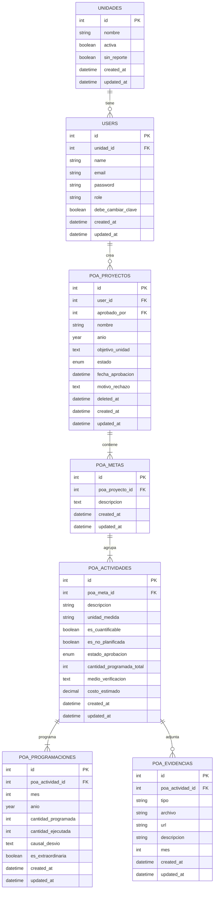

# Modelos y Base de Datos

## Diagrama de Entidad-Relación



## Descripción de Modelos

### `PoaActividad` — El modelo central

Es el corazón del sistema. Tiene un observer `booted()` que al crearse **genera automáticamente 12 registros** de `PoaProgramacion` (uno por cada mes del año):

```php
protected static function booted()
{
    static::created(function ($actividad) {
        $anio = $actividad->meta->proyecto->anio ?? date('Y');
        $batch = [];
        for ($i = 1; $i <= 12; $i++) {
            $batch[] = [
                'poa_actividad_id'  => $actividad->id,
                'mes'               => $i,
                'anio'              => $anio,
                'cantidad_programada' => 0,
            ];
        }
        PoaProgramacion::insert($batch);
    });
}
```

### Enums importantes

| Modelo | Campo | Valores |
|---|---|---|
| `PoaProyecto` | `estado` | `BORRADOR`, `ENVIADO`, `APROBADO`, `RECHAZADO`, `OBSERVADO` |
| `PoaActividad` | `estado_aprobacion` | `PENDIENTE`, `APROBADO`, `RECHAZADO` |
| `PoaEvidencia` | `tipo` | `PDF`, `FOTO`, `VIDEO`, `URL`, `MP3` |

### Constraint único en `PoaProgramacion`

```sql
UNIQUE(poa_actividad_id, mes, anio)
```
Evita duplicados de programación por actividad/mes/año.

### SoftDeletes en `PoaProyecto`

Los proyectos no se eliminan físicamente inmediatamente — van a la papelera (`deleted_at`). El Admin puede restaurarlos desde el panel.
