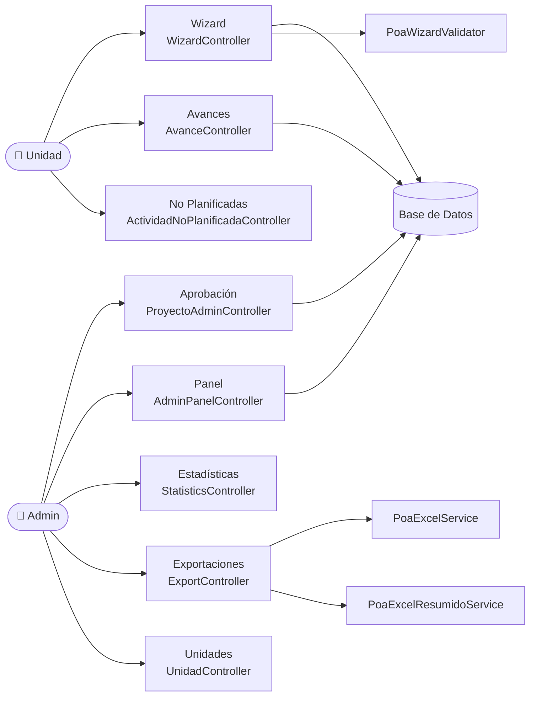

# Visión General de la Arquitectura

## Estructura de Carpetas

```
app/
├── Http/
│   ├── Controllers/
│   │   ├── Poa/              ← Módulos de la unidad
│   │   │   ├── PoaController.php
│   │   │   ├── WizardController.php
│   │   │   ├── AvanceController.php
│   │   │   └── ActividadNoPlanificadaController.php
│   │   └── Admin/            ← Módulos del administrador
│   │       ├── ProyectoAdminController.php
│   │       ├── AdminPanelController.php
│   │       ├── UnidadController.php
│   │       ├── StatisticsController.php
│   │       ├── ExportController.php
│   │       └── CatalogController.php
│   └── Middleware/
├── Models/                   ← Eloquent ORM
│   ├── Unidad.php
│   ├── User.php
│   ├── PoaProyecto.php
│   ├── PoaMeta.php
│   ├── PoaActividad.php
│   ├── PoaProgramacion.php
│   ├── PoaEvidencia.php
│   ├── MetaPredeterminada.php
│   └── ObjetivoEspecificoPredeterminado.php
└── Services/                 ← Lógica de negocio desacoplada
    ├── PoaWizardValidator.php
    ├── PoaExcelService.php
    └── PoaExcelResumidoService.php
```

## Diagrama de Módulos



## Convenciones del Proyecto

- **Controladores** → Solo orquestan: validan, delegan a servicios y retornan vistas/redirecciones.
- **Modelos** → Contienen relaciones Eloquent y `$casts`. La lógica de negocio compleja va a **Services**.
- **Services** → Clases standalone inyectadas via constructor. Contienen reglas de negocio reutilizables.
- **Todas las mutaciones** se envuelven en `DB::transaction()` para garantizar consistencia.
