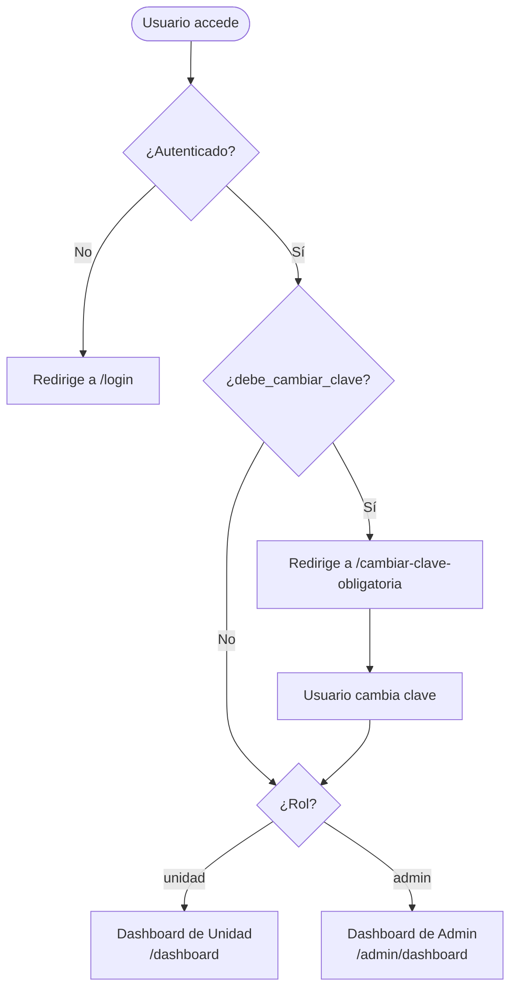

# Roles y Middleware

## Roles del Sistema

El sistema tiene dos roles definidos via columna `role` en la tabla `users`:

| Rol | Valor BD | Descripción |
|---|---|---|
| **Admin** | `admin` | Acceso completo al panel administrativo |
| **Unidad** | `unidad` | Acceso a su propio dashboard, wizard y avances |

## Middleware de Rutas

```php
// web.php — Estructura de middleware
Route::middleware(['auth'])->group(function () {

    // Fuerza cambio de clave → accesible por TODOS los roles autenticados
    Route::get('/cambiar-clave-obligatoria', ...);

    // Zona de Unidad
    Route::middleware(['role:unidad', 'check.password.change'])->group(function () {
        Route::get('/dashboard', ...);
        Route::prefix('poa/wizard')->group(...);
        Route::prefix('poa/avances')->group(...);
    });

    // Zona de Admin
    Route::middleware(['role:admin', 'check.password.change'])->prefix('admin')->group(function () {
        Route::get('/dashboard', ...);
        Route::prefix('unidades')->group(...);
        Route::prefix('proyectos')->group(...);
        Route::prefix('panel')->group(...);
    });
});
```

## Flujo de Autenticación



## Helpers de Rol en el Modelo `User`

```php
$user->isAdmin();   // true si role === 'admin'
$user->isUnidad();  // true si role === 'unidad'
```

::: warning
Si agregas un nuevo rol, debes:
1. Actualizar el `enum` en la migración o agregar una nueva migración.
2. Crear un grupo de rutas con `middleware(['role:nuevo_rol'])`.
3. Agregar el helper `isNuevoRol()` en el modelo `User`.
:::
