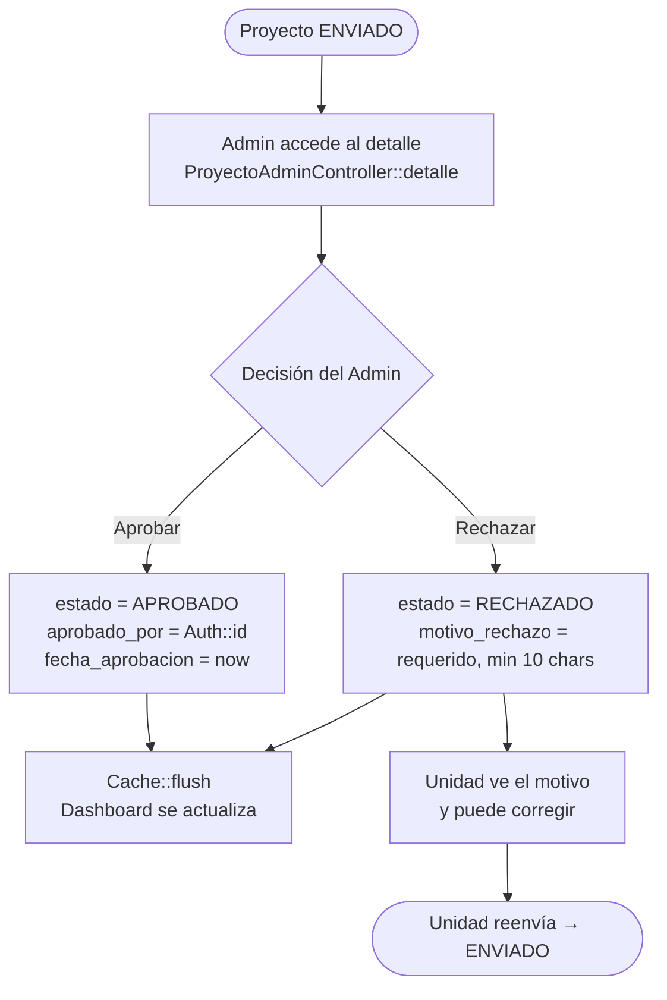

# Panel de Aprobación (Admin)

`ProyectoAdminController` — Gestiona el flujo de aprobación/rechazo de proyectos enviados por las unidades.

## Ciclo de Aprobación



## Métricas calculadas en la Vista de Detalle

```php
// Conteo de actividades del proyecto
$total_actividades = PoaActividad::whereHas('meta', fn($q) =>
    $q->where('poa_proyecto_id', $proyectoId)
)->count();

// Presupuesto total (suma de costo_estimado de todas las actividades)
$presupuesto_total = PoaActividad::whereHas(...)->sum('costo_estimado');

// Total de evidencias adjuntadas en todo el proyecto
$total_evidencias = PoaEvidencia::whereHas('actividad.meta', ...)->count();
```

## Panel Administrativo Completo

`AdminPanelController` ofrece CRUD completo para:

| Entidad | Operaciones |
|---|---|
| **Proyectos** | Ver, editar, eliminar, restaurar (soft delete), vaciar papelera |
| **Usuarios** | Crear, editar, eliminar |
| **Unidades** | Crear, editar, eliminar |
| **Metas** | Crear, editar, eliminar (catálogo global) |
| **Actividades** | Crear, editar, eliminar (catálogo global) |

## Dashboard de Estadísticas

`StatisticsController` provee una vista global del sistema con:
- Cumplimiento por unidad
- Comparativas trimestrales
- Exportación a Excel y PDF (`ExportController`)
