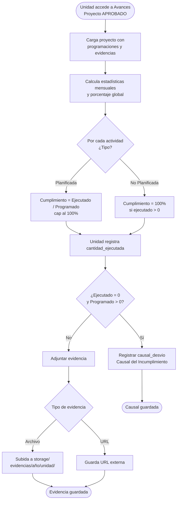

# Registro de Avances y Evidencias

`AvanceController` — Permite a la unidad registrar la ejecución mensual de sus actividades y subir evidencias.

## Flujo del Módulo



## Cálculo del Porcentaje de Cumplimiento

### Actividades planificadas
```
cumplimiento = (ejecutado_efectivo / programado) * 100
```
Donde `ejecutado_efectivo = min(programado, ejecutado)` — nunca supera el 100%.

### Actividades no planificadas
```
cumplimiento = (total_ejecutado > 0) ? 100% : 0%
```
Si se ejecutó aunque sea 1 unidad, se considera cumplida al 100%.

::: warning
Las actividades **no planificadas** no se cuentan en el cálculo del cumplimiento global del dashboard. Solo las actividades planificadas y cuantificables entran en ese cómputo.
:::

## Tipos de Evidencia Soportados

| Tipo | Descripción | Límite |
|---|---|---|
| `PDF` | Documento PDF | 30 MB |
| `FOTO` | Imagen fotográfica | 30 MB |
| `VIDEO` | Archivo de video | 30 MB |
| `URL` | Enlace externo | — |
| `MP3` | Audio | 30 MB |

## Organización del Storage

Las evidencias se guardan en:
```
storage/app/public/evidencias/{año}/{slug-unidad}/{archivo}
```

Ejemplo: `storage/app/public/evidencias/2026/obras-publicas/informe-enero.pdf`

## Causal del Incumplimiento

Cuando `cantidad_ejecutada = 0` y `cantidad_programada > 0` en un mes dado, el sistema permite registrar una causal de desvío (`causal_desvio`) que aparecerá en los reportes Excel en la columna "Medio de Verificación o Causal del Incumplimiento".
