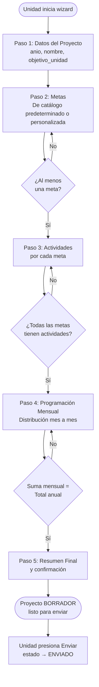

# Wizard de Planificación

`WizardController` — El módulo más importante del sistema. Guía a la unidad a través de 5 pasos para crear su Plan Operativo Anual.

## Flujo del Wizard



## Validaciones por Paso (`PoaWizardValidator`)

Las validaciones son **cascada**: el paso N verifica todos los pasos anteriores antes de permitir el acceso.

| Paso | Regla de negocio |
|---|---|
| **Paso 3** | El proyecto debe tener al menos 1 meta |
| **Paso 4** | Todas las metas deben tener al menos 1 actividad |
| **Paso 5** | Para actividades cuantificables: `suma_mensual == total_anual` |

```php
// PoaWizardValidator::checkDistribution()
$totalAnual  = (int) $actividad->cantidad_programada_total;
$sumaMensual = (int) $actividad->programaciones->sum('cantidad_programada');

if ($totalAnual !== $sumaMensual) {
    // Error — rechaza avanzar al paso 5
}
```

## Comportamiento automático al crear Actividades

Al guardar una `PoaActividad`, el sistema crea automáticamente **12 registros de `PoaProgramacion`** (uno por mes, todos en 0). Esto ocurre en el método `booted()` del modelo.

::: info
El usuario solo necesita ingresar los valores en el Paso 4. Las filas mensuales ya existen desde que se crea la actividad.
:::

## Edición (solo en estado BORRADOR)

Las metas y actividades se pueden editar con `updateMeta()` y `updateActividad()`, pero **únicamente si el proyecto está en estado `BORRADOR`**. El sistema verifica esto antes de guardar.

## Flujo de Envío

```php
// WizardController::sendProject()
PoaProyecto::where('user_id', Auth::id())
    ->where('estado', 'BORRADOR')   // ← Solo borradores
    ->findOrFail($id)
    ->update(['estado' => 'ENVIADO']);
```
